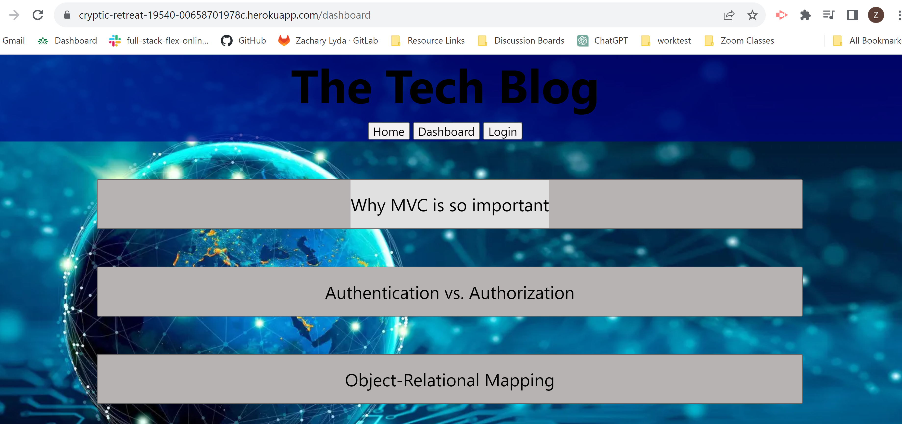

# turbo-octo-spork

# Steps

## Start out by setting up the db folder with the schema file with in it.

## set up the .env, gitignore,  and package.json files.

## set up the server.js and the config folder with the connection.js file.

## set up the utils folder with the auth and the helpers files.

## set up the models and the seeds files.

## set up the homepage with the appropriate routes, depending on what all you want it to have on it.

## set up the javascript and routes for the home, dashboard, login, logout and new post anchor tags.

## with in the dashboard have it render the blog posts with in the table and allow them to be buttons.

## set up a route to fetch the specific post based on which one you click on.

## set up the delete and update functions and routes.

## set up the create comment route and function.

## set up logged in checks on whether you can view the details of the blog post or make a comment or make a blog.

## stylize everything after you have it all functioning properly.

# Link to GitHub:

##  https://zlyda1993.github.io/glowing-spork/

# Link to Deployed Application:

## https://cryptic-retreat-19540-00658701978c.herokuapp.com/dashboard

# Screen Shot of deployed application:

 
